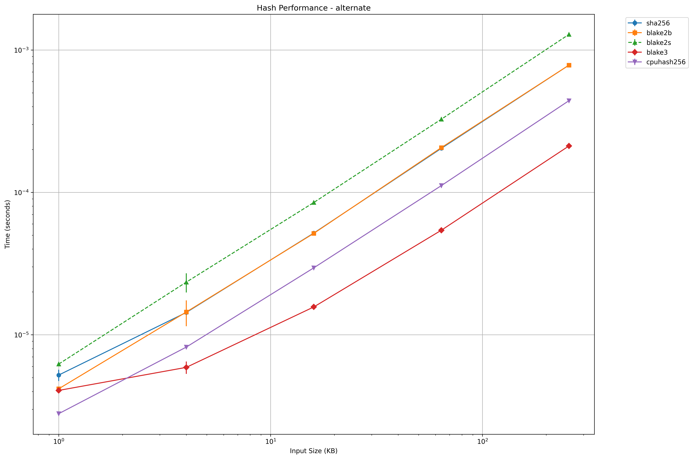
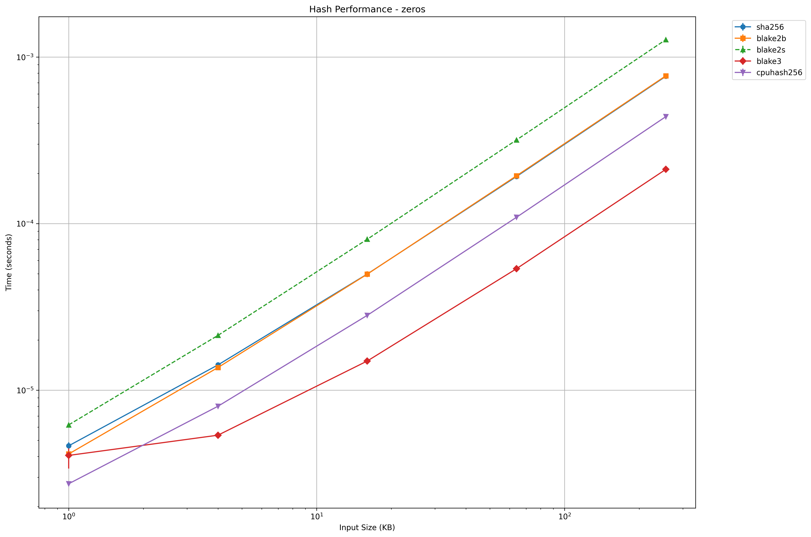

# CPUHash256

This is the test suite (also includes the CPUHash256 C implementation) for Python benchmark and testing

## Building
```
python3 setup.py build_ext --inplace
```

### Installing
```
pip uninstall cpuhash256  # Remove any existing installations
pip install -e .  # Install in development mode
```

### Running Tests
```
python3 hash_performance_test.py
```

## Benchmark tests






## Security tests

